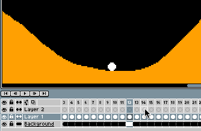
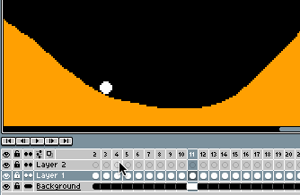

# Animation

Aseprite's main goal is to be a tool to create animations. The
[timeline](timeline.md) gives you total control over frames and
[cels](cel.md).

First of all you should learn
[the difference between a frame and a cel](cel.md).

### Common Operations

1. [Add a new frame copying the current one](new-frame.md)
1. [Add a new empty frame](new-frame.md#new-empty-frame)
1. [Copy frames](copy-frames.md) or [cels](copy-cels.md)
1. [Move frames](move-frames.md) or [cels](move-cels.md)
1. Remove frames
1. Reuse frames
1. Tag several frames
1. [Change the duration of a specific frame](frame-duration.md)
1. Copy frames to other file
1. [Loop a section](loop.md)

### Onion skinning

With [onion skinning](https://en.wikipedia.org/wiki/Onion_skinning)
you can see several frames at once in the sprite editor. In this way
you can use other frames as reference to draw the current one. You can
activate the onion skinning using `F3` key or the little
 icon in the timeline:

You can specify how many previous and next frames do you want to see
and configure other settings from the
 icon (like red/blue tint):

---

**SEE ALSO**

[Timeline](timeline.md) |
[Continuous Layers](continuous-layers.md)
